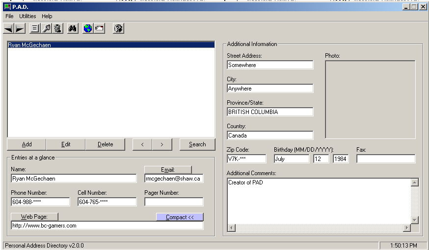



## Personal Address Directory \(PAD\)

### Description

This program demonstrates how to access, modify, and save information from a Microsoft Access Database file, using a GUI. Users can add view information with a listbox, open a webbrowser to a contact's url, even send them an email using the default email client on their machine.
 
### More Info
 

             |
---                |---
**Submitted On**   |2002-12-20 13:51:08
**By**             |[Ryan McGechaen](https://github.com/Planet-Source-Code/PSCIndex/blob/master/ByAuthor/ryan-mcgechaen.md)
**Level**          |Intermediate
**User Rating**    |4.8 (29 globes from 6 users)
**Compatibility**  |VB 6\.0
**Category**       |[Databases/ Data Access/ DAO/ ADO](https://github.com/Planet-Source-Code/PSCIndex/blob/master/ByCategory/databases-data-access-dao-ado__1-6.md)
**World**          |[Visual Basic](https://github.com/Planet-Source-Code/PSCIndex/blob/master/ByWorld/visual-basic.md)
**Archive File**   |[Personal\_A15162412202002\.zip](https://github.com/Planet-Source-Code/ryan-mcgechaen-personal-address-directory-pad__1-41745/archive/master.zip)

